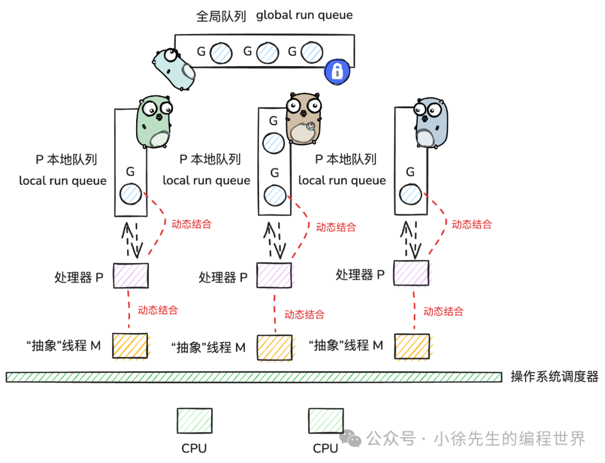

> 如果把 golang 程序比做一个人的话，那么 gmp 就是这个人的骨架，支持着他的直立与行走；而在此基础之上，紧密围绕着 gmp 理念打造设计的一系列工具、模块则像是在骨架之上填充的血肉，是依附于这套框架而存在的.

参考[Go GMP 万字洗髓经](https://mp.weixin.qq.com/s/BR6SO7bQF4UXQoRdEjorAg)

本篇文章将首先宏观梳理GMP模型的基本概念，架构，然后我们着眼于微观层面一个Goroutine的生命周期，以求达到对GMP模型的全面深入的理解

# 宏观-整体把握

## 线程-Coroutine-Goroutine

- 线程是操作系统级别的，内核调度的
- 协程（Coroutine），用户态下对线程的二次封装
-  协程与线程的关系是**N：1**
- 协程相比于线程更轻量，开销更小

**Go协程**（Goroutine）就是Go语言对协程的**本土化实现**，做了很大的优化**改进**，改进得来的模型就是**GMP**

改进优势：
1. 栈大小动态扩缩
2.  G和MP动态结合，实现goroutine与线程**N：M**，更加灵活高效

## GMP整体架构

### 把GMP看作一个任务调度系统

- G：任务，需要绑定在M上执行
- M：引擎，是对线程的抽象封装，需要与P结合才能正常执行，有特殊g0负责任务寻找
- P：中枢，决定了最大并行数，带有存储容器承载被调度的g

### 存储g的容器

- 本地队列 local run queue P私有，并发竞争少（除了stealing work），无锁化设计
- 全局队列 global run queue 全局调度模块schedt中，要加全局锁

### 放G，取G

-  put g：就近原则：当某个 g 中通过 go func(){...} 操作创建子 g 时，会先尝试将子 g 添加到当前所在 p 的 lrq 中（无锁化）；如果 lrq 满了，则会将 g 追加到 grq 中（全局锁）. 
-  get g：gmp 调度流程中，m 和 p 结合后，运行的 g0 会不断寻找合适的 g 用于执行，此时会采取“负载均衡”的思路，遵循如下实施步骤：
	-  优先从当前 p 的 lrq 中获取 g（无锁化-CAS）
	-  从全局的 grq 中获取 g（全局锁）
	-  取 io 就绪的 g（netpoll 机制）
	- 从其他 p 的 lrq 中窃取 g（无锁化-CAS）
	- 兜底：每进行61次调度循环，去global run queue 里找一次，避免“饥荒”